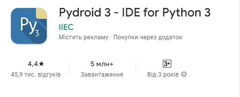
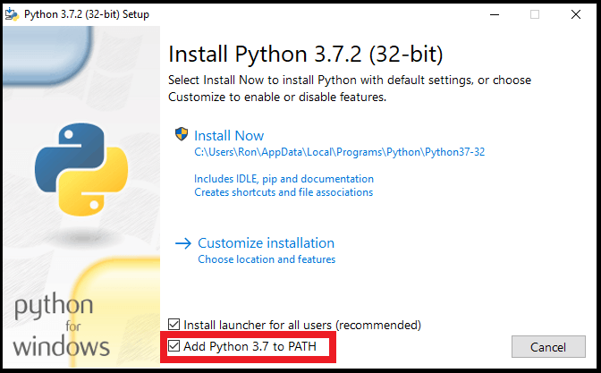

# AutoZoomLinker

Привет! Этот скрипт был создан, чтобы облегчить процесс поиска и подключения к Zoom-конференциям для школьников. Просто запустите скрипт, и он автоматически найдет нужную ссылку и откроет ее в вашем браузере.

## Особенности

- **Гибкое расписание:** Настройте расписание уроков и свяжите каждый предмет с соответствующей Zoom-ссылкой.
- **Легкость использования:** Просто запустите скрипт и наслаждайтесь автоматическим подключением к урокам.

# Как скачать с сайта?

Переходите в папку которая соответствует вашей ОС, зачем скачайте все файлы в этой папке. Сделать это можно кликнув на файл, затем нажать на кнопку загрузки.

## Использование

### Для Android

Для начала перейдите в Play Market, затем найдите там приложение Pydroid 3 - IDE for Python 3

#### Фотография приложения

Установите приложение, скачайте скрипт, затем откройте через приложение settings.py

Для запуска нажмите на кнопку, которая показана на фотографии:

После того, как вы последуете инструкциям в скрипте, вам нужно окрыть main.py, удалить комментарий на 6 строке и вместо него вставить то, что вы скопировали

Готово, можете пользоваться скриптом, удачной настройки!

#### Почему так сложно?

Дело в том, что на Android, IDE не дает создавать файл с настройкой в той же папке, что и скрипт, по этому приходится пользоваться костылями, но вы можете попробовать версию для Windows, возможно у вас получится.

## Может быть полезно для Android

#### [Как создать ярлык на скрипт для удобного входа в него с рабочего стола](https://youtube.com/shorts/lod0MMO5TFk?feature=share)

### Для Windows

Переходим на сайт Python, затем скачиваем последнюю версию Python: https://www.python.org/

При загрузке Python, обязательно ставим галочку на "Add to Path"

Затем нажимаем на "Install Now"

После загрузки скачиваем скрипт, затем запускаем с помощью Python

Готово, можете пользоваться скриптом, удачной настройки!

# Как поделиться настройками?

## Для Android

Вы можете поделится скопированным текстом, который у вас копируется в буфер обмена во время завершения работы settings.py

## Для Windows

После того, как вы создали свои настройки, в папке куда вы сохраняли скрипт, появился файл settings.json.

Вы можете скопировать этот файл, затем отправиль человеку, с которым хотите поделиться настройками.

# Как импортировать настройки?

## Для Android

Вы копируете текст, которым с вами поделились, затем вам нужно окрыть main.py, удалить комментарий на 6 строке и вместо него вставить то, что вы скопировали

## Для Windows

Если с вами поделились настройками и вы хотите сохранить их и использовать, тогда вам нужно скопировать их и перейти в ту папку, где у вас сохранился скрипт, вставить файл с настройками и все, можете пользоваться скриптом!

# ВСЕМ ЖЕЛАЮ УДАЧНОГО ИСПОЛЬЗОВАНИЯ!!!
